# Hub-and-Spoke Virtual Network Peering Architecture with Azure CLI

Comprehensive documentation covering the deployment, configuration, and end-to-end connectivity validation of an Azure Virtual Network peering topology configured via the Azure CLI. The architecture establishes bidirectional regional and global peering connections between a central hub network (`MarketingVNet`) and isolated spoke networks (`SalesVNet` and `ResearchVNet`), confirming effective routing tables and private intra-VNet reachability.

---

## 1. Architecture & Provisioned Resources

### Core Infrastructure Topology

| Resource Type | Resource Name | Region | Subnet & CIDR Prefix | Private IP | Public IP |
| :--- | :--- | :--- | :--- | :--- | :--- |
| **Spoke Virtual Network** | `SalesVNet` | East US | `Apps` (`10.1.1.0/24`) | — | — |
| **Hub Virtual Network** | `MarketingVNet` | East US | `Apps` (`10.2.1.0/24`) | — | — |
| **Spoke Virtual Network** | `ResearchVNet` | West US | `Data` (`10.3.1.0/24`) | — | — |
| **Virtual Machine** | `SalesVM` | East US | `Apps` (`10.1.1.0/24`) | `10.1.1.4` | `74.235.249.186` |
| **Virtual Machine** | `MarketingVM` | East US | `Apps` (`10.2.1.0/24`) | `10.2.1.4` | `172.191.199.139` |
| **Virtual Machine** | `ResearchVM` | West US | `Data` (`10.3.1.0/24`) | `10.3.1.4` | `40.112.238.100` |

---

### Provisioned Environment Validation

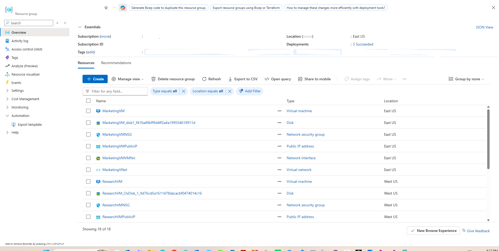

*Resource group overview confirming the deployment of all virtual networks, compute instances, network interfaces, and associated security groups.*

---

## 2. Step-by-Step Implementation

### Step 1: Provision Multi-Region Virtual Networks

Deployed three virtual networks with non-overlapping IP address prefixes across the East US and West US regions to host independent departmental workloads.

* **SalesVNet:** `10.1.0.0/16` in `eastus` with subnet `Apps` (`10.1.1.0/24`)
* **MarketingVNet:** `10.2.0.0/16` in `eastus` with subnet `Apps` (`10.2.1.0/24`)
* **ResearchVNet:** `10.3.0.0/16` in `westus` with subnet `Data` (`10.3.1.0/24`)

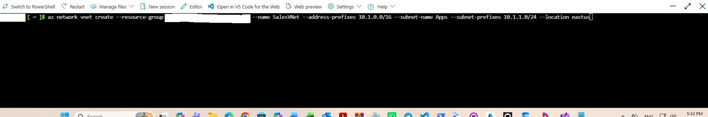

*Creating SalesVNet and its associated Apps subnet using Azure CLI.*

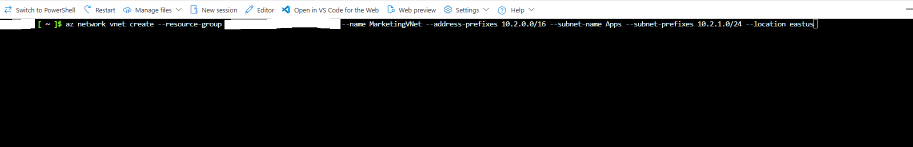

*Creating MarketingVNet and its associated Apps subnet using Azure CLI.*

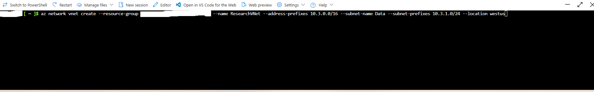

*Creating ResearchVNet and its associated Data subnet using Azure CLI.*

---

### Step 2: Validate Virtual Network Provisioning State

Queried the provisioned virtual networks to confirm that all three instances were created and reached a `Succeeded` provisioning state.

* **Command Executed:** `az network vnet list --query "[?contains(provisioningState, 'Succeeded')]" --output table`
* **Target Networks:** `ResearchVNet`, `MarketingVNet`, `SalesVNet`

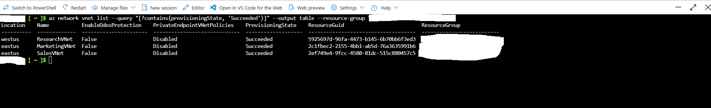

*Azure CLI output verifying successful deployment across East US and West US regions.*

---

### Step 3: Deploy Compute Workloads

Provisioned Ubuntu Linux virtual machines within each dedicated subnet using the `az vm create` command.

* **SalesVM:** Standard B2s deployed to `SalesVNet/Apps` in `eastus`
* **MarketingVM:** Standard B2s deployed to `MarketingVNet/Apps` in `eastus`
* **ResearchVM:** Standard B2s deployed to `ResearchVNet/Data` in `westus`

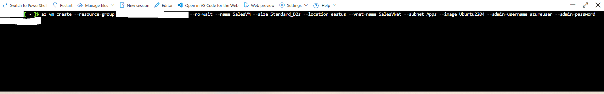

*Deploying SalesVM within SalesVNet via Azure CLI.*

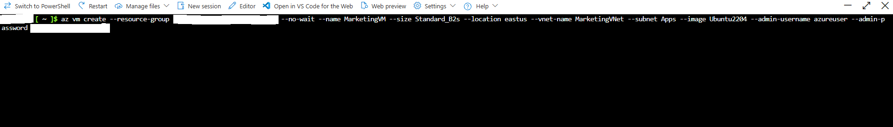

*Deploying MarketingVM within MarketingVNet via Azure CLI.*

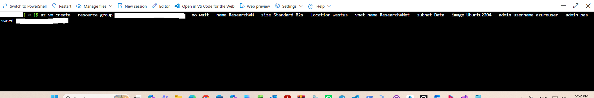

*Deploying ResearchVM within ResearchVNet via Azure CLI.*

---

### Step 4: Validate Virtual Machine Health and Network Configuration

Monitored the virtual machine provisioning lifecycle and queried the allocated network addressing for all three instances.

* **Command Executed:** `az vm list --query "[*].{Name:name, PrivateIP:privateIps, PublicIP:publicIps}" --show-details --output table`
* **SalesVM:** Private IP `10.1.1.4` | Public IP `74.235.249.186`
* **MarketingVM:** Private IP `10.2.1.4` | Public IP `172.191.199.139`
* **ResearchVM:** Private IP `10.3.1.4` | Public IP `40.112.238.100`

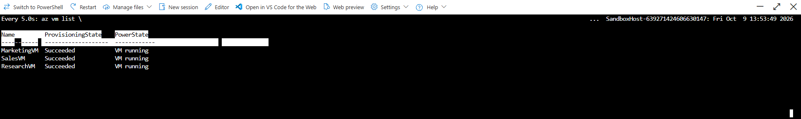

*Verifying running power state and successful provisioning for all virtual machines.*

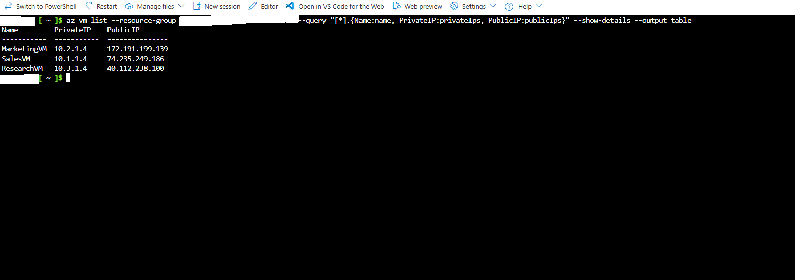

*Confirming private and public IP address allocations via Azure CLI.*

---

### Step 5: Configure Hub-and-Spoke Peering Links

Established reciprocal virtual network peering connections between `MarketingVNet` (Hub) and the spoke networks (`SalesVNet` and `ResearchVNet`).

* **Regional Peering Link:** `MarketingVNet-To-SalesVNet` and `SalesVNet-To-MarketingVNet`
* **Global Peering Link:** `MarketingVNet-To-ResearchVNet` and `ResearchVNet-To-MarketingVNet`

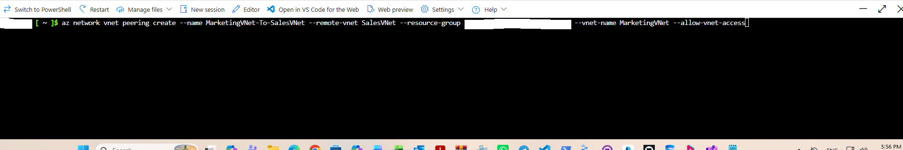

*Creating the peering connection from MarketingVNet to SalesVNet.*

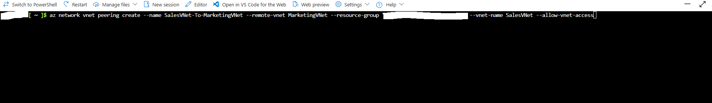

*Creating the reciprocal peering connection from SalesVNet to MarketingVNet.*

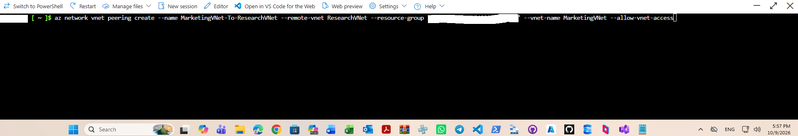

*Creating the global peering connection from MarketingVNet to ResearchVNet.*

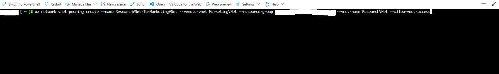

*Creating the reciprocal peering connection from ResearchVNet to MarketingVNet.*

---

### Step 6: Validate Peering Connection Status

Verified that all configured peering links transitioned to an active `Connected` state across the hub and spoke virtual networks.

* **MarketingVNet Links:** Connected to both `SalesVNet` and `ResearchVNet`
* **SalesVNet Link:** Connected to `MarketingVNet`
* **ResearchVNet Link:** Connected to `MarketingVNet`

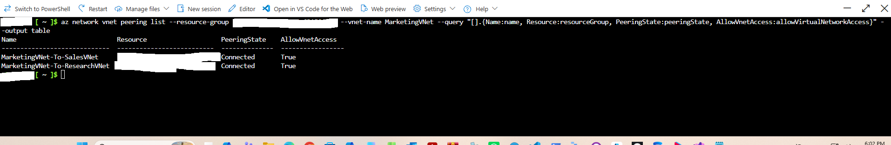

*Confirming Connected state for all peering connections on MarketingVNet.*

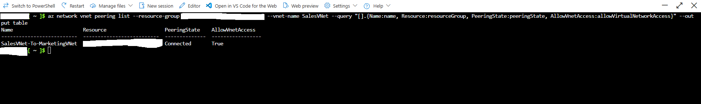

*Confirming Connected state for the peering link on SalesVNet.*

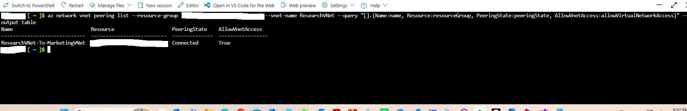

*Confirming Connected state for the peering link on ResearchVNet.*

---

### Step 7: Inspect Effective Network Routes

Queried the effective route tables on the network interfaces to confirm the dynamic injection of peering next-hop routes.

* **SalesVMVMNic:** Routes `10.2.0.0/16` traffic to next-hop type `VNetPeering`
* **MarketingVMVMNic:** Routes `10.1.0.0/16` to `VNetPeering` and `10.3.0.0/16` to `VNetGlobalPeering`
* **ResearchVMVMNic:** Routes `10.2.0.0/16` traffic to next-hop type `VNetGlobalPeering`

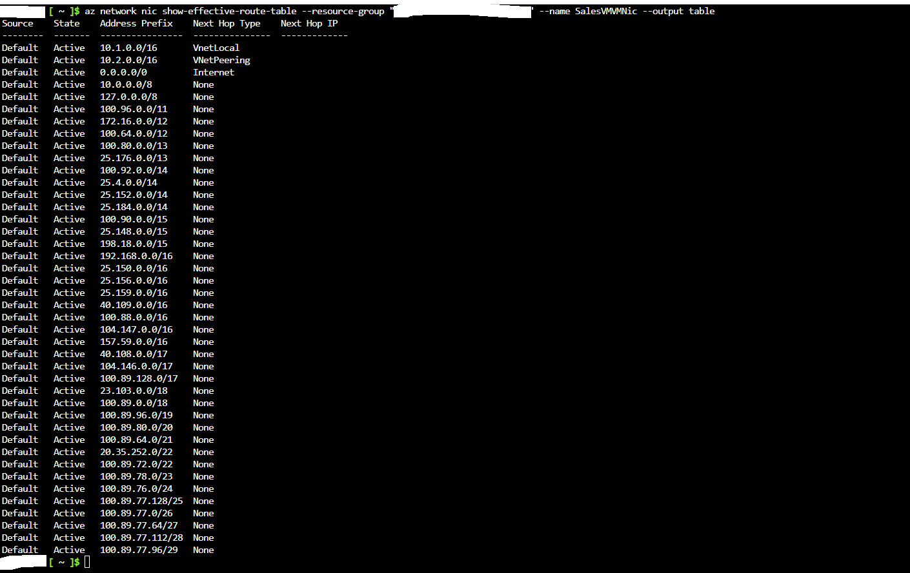

*Inspecting effective routing table on SalesVMVMNic showing VNetPeering next-hop.*

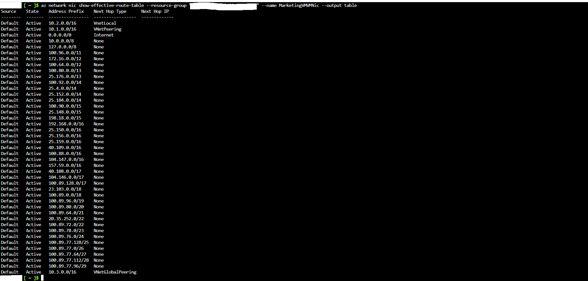

*Inspecting effective routing table on MarketingVMVMNic showing both regional and global peering next-hops.*

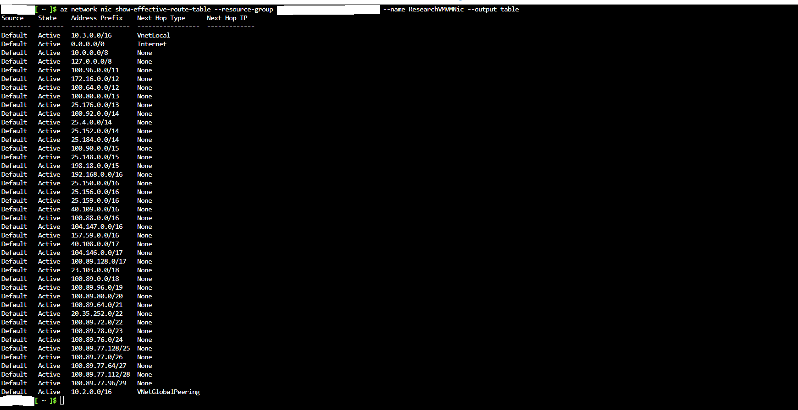

*Inspecting effective routing table on ResearchVMVMNic showing VNetGlobalPeering next-hop.*

---

### Step 8: Validate End-to-End Private Network Connectivity

Conducted multi-hop SSH validation to verify internal traffic routing across peered networks without routing over public endpoints.

* Connected to `SalesVM` via its public IP address (`74.235.249.186`).
* Initiated a nested SSH session from `SalesVM` to `MarketingVM` via private IP (`10.2.1.4`).
* Initiated a nested SSH session from `MarketingVM` to `ResearchVM` via private IP (`10.3.1.4`).

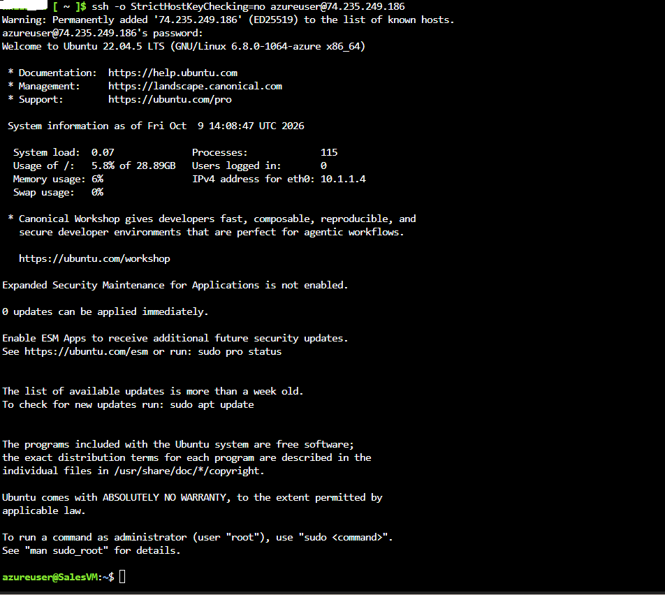

*Authenticating to SalesVM via public SSH endpoint.*

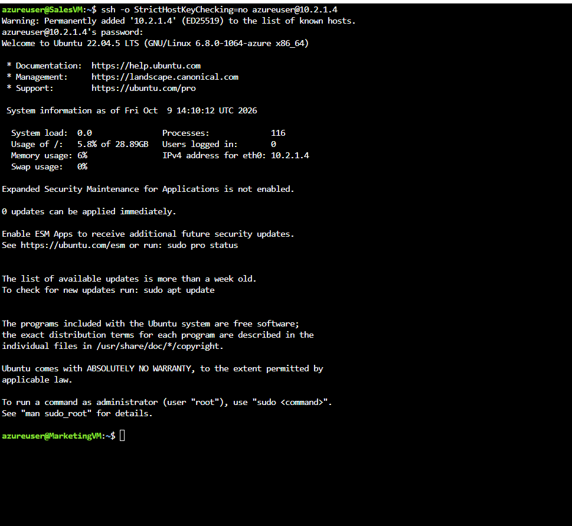

*Traversing the regional peering link from SalesVM to MarketingVM using private IP 10.2.1.4.*

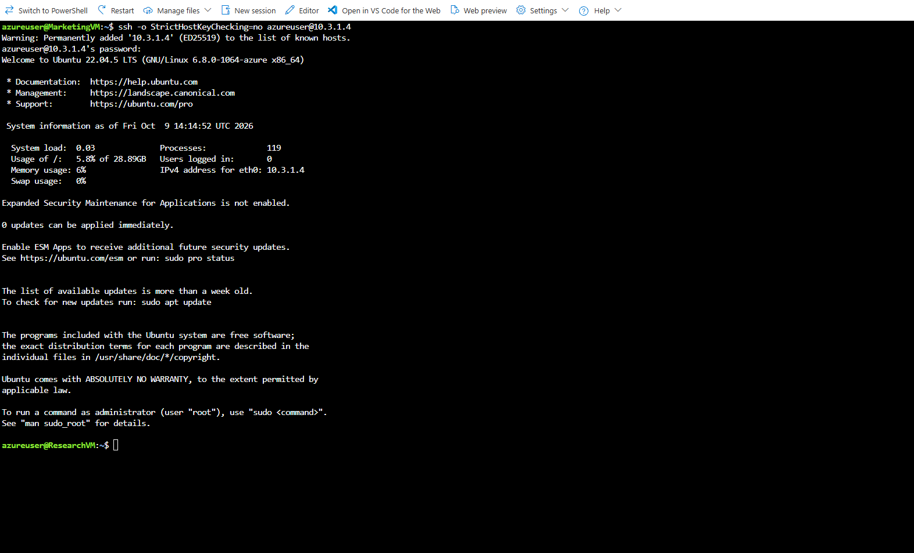

*Traversing the global peering link from MarketingVM to ResearchVM using private IP 10.3.1.4.*
